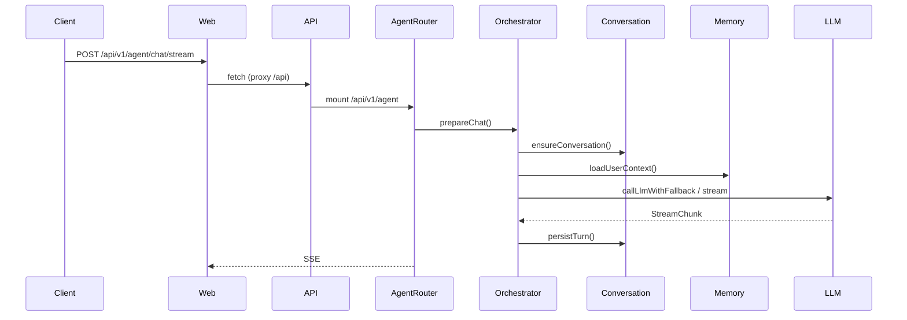
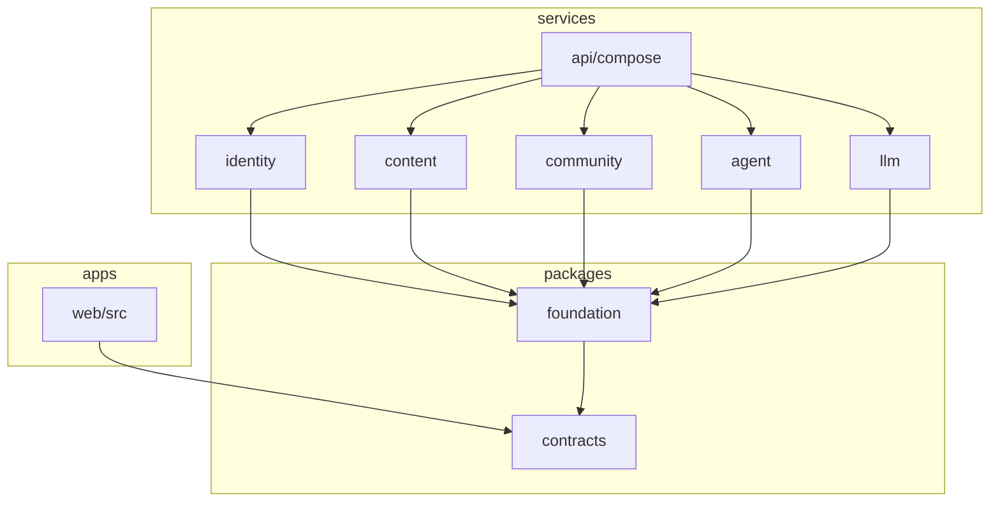

# 架构审查报告 — AgentForge (Grimoire)

> **审查日期**: 2026-09-02  
> **审查者**: Composer (Cursor)  
> **审查范围**: commit `e61a0e2591a1b53b3e7e36b910eb2e9a00e4ae43` / branch `master` / 全仓源码（非抽样）  
> **代码行数**: 约 61,870 行（含文档/配置）；TypeScript/JS 源码约 22,171 行，测试约 2,474 行  
> **模块数**: 12 workspace 包 · **业务数**: 6 核心 + 2 支撑 · **审查文件数**: 304（排除 node_modules/dist）  
> **总体评级**: ⭐ **中**  
> **P0 问题**: 3 · **严重问题**: 5 · **总违例**: 38

---

## 0. 摘要 (Executive Summary)

### 0.1 一句话定论

后端域边界设计扎实（`@core/contracts` 端口 + CI 强制 `check-domain-boundaries.mjs`），但**前端 `apps/web` 仍是多业务上帝对象/上帝组件**，且**共享 SQLite + 进程内可变状态**在多实例部署下会破坏边界语义——架构「纸面解耦」与「运行时可替换性」之间存在明显裂缝。

### 0.2 TOP 10 关键问题

| 序 | 原则优先级 | 严重度 | 位置 | 问题 | 影响 |
| --- | --- | --- | --- | --- | --- |
| 1 | P0 | 严重 | `apps/web/src/lib/api.ts:134-442` | 单一 `api` 对象覆盖 auth/articles/community/agent 等 10+ 业务域 | 任一域 API 变更牵动全文件；无法按域独立演进/测试 |
| 2 | P0 | 严重 | `apps/web/src/components/agent/AgentFloat.tsx:1-918` | 悬停 Agent + 面板 Agent UI/状态/流式/动画混于 918 行组件 | 双 Agent 模式无法独立迭代；圈复杂度高 |
| 3 | P0 | 高 | `services/content/src/routes/articles.ts:34-333` | Fat Router：路由 + Zod + 浏览去重缓存 + 权限 + CRUD 同文件 | content 域内职责混杂，单测困难 |
| 4 | P1 | 严重 | `apps/web/src/components/agent/AgentFloat.tsx` | 上帝文件 918 行（阈值严重 500） | 维护/审查成本极高 |
| 5 | P1 | 高 | `services/agent/src/services/agentOrchestrator.ts:24-319` | Schema 定义、编排、缓存策略、错误映射、记忆副作用同文件 | 变更理由 >3（路由契约/编排/缓存各独立） |
| 6 | P2 | 严重 | `services/api/prisma/schema.prisma:1-322` | 15 模型单库共享；各域服务均注入同一 `PrismaClient` | 物理层未隔离；仅靠脚本约束跨域表访问 |
| 7 | P2 | 高 | `services/content/src/routes/articles.ts:42-56` 等 | 进程内 `Map` 状态（浏览去重、Agent 上下文缓存、LLM Provider 缓存） | 多实例部署计数/缓存不一致 |
| 8 | P2 | 高 | `services/api/src/index.ts:8` vs `scripts/dev.mjs:26` | API 默认端口 `3001` 与开发脚本/文档 `8181` 不一致 | 直连 `dev:api` 与 `npm run dev` 行为分裂 |
| 9 | P2 | 高 | `services/agent/src/routes/chat.ts:17` | 路由层 import 编排层 Zod schema | 层间反向依赖，替换 orchestrator 牵动路由 |
| 10 | P3 | 中 | `apps/web` 全目录 | 前端零测试（21 个 `*.test.ts` 均在后端/packages） | 22k+ 行 UI 无自动化回归网 |

### 0.3 修复路线图 (3 阶段)

- **阶段 1（立即，P0）**: 拆分 `api.ts` 为按域模块（`api/articles.ts`、`api/agent.ts`…）；将 `AgentFloat.tsx` 拆为 `HoverTip` + `AgentPanelShell` + hooks；将 `articles.ts` 中的 `viewedCache` 与 handler 逻辑下沉到 `services/viewTracking.ts`
- **阶段 2（下个迭代，P1）**: 将 `explainSchema`/`chatSchema` 移至 `routes/schemas.ts` 或 `contracts`；继续瘦身 `agentOrchestrator.ts`；统一 API 默认端口为 `8181`（`index.ts` 与 `dev.mjs` 对齐）
- **阶段 3（可延后，P2）**: 为多实例就绪引入 Redis 适配层（浏览去重、hover/agent 上下文缓存）；评估按域拆分 Prisma schema 或迁移 PostgreSQL；补充 `apps/web` Vitest + 关键路径组件测试

### 0.4 总体统计

| 维度 | 数值 |
| --- | --- |
| 上帝文件数 (>300 行警告 / >500 行严重) | 警告 8 / 严重 2 |
| 循环依赖数 (相对 import SCC) | 0 |
| 跨层引用数 | 2 |
| 命名违例数 | 6 |
| 跨业务文件数 | 3 |
| 隐式全局依赖数 | 7 |
| 业务调用矩阵杂糅度 | 2（前端 api 层、AgentFloat） |
| 架构优雅主观分 (§1.9) | 16/25 |

---

## 1. 总体架构总览

### 1.1 目录结构树 (到 3 级)

```
AgentForge/
├── apps/
│   ├── web/          # @core/web — React 19 + Vite 8
│   ├── desktop/      # @core/desktop — 占位
│   └── mobile/       # @core/mobile — 占位
├── packages/
│   ├── contracts/    # @core/contracts — DTO/端口/权限
│   └── foundation/   # @core/foundation — JWT/SSE/错误/BYOK
├── services/
│   ├── api/          # @core/api — 组合根 + Prisma
│   ├── identity/     # @core/identity
│   ├── content/      # @core/content
│   ├── community/    # @core/community
│   ├── agent/        # @core/agent
│   ├── llm/          # @core/llm
│   └── mcp/          # @core/mcp — 占位
├── scripts/          # dev.mjs, check-domain-boundaries.mjs
└── docs/
```

### 1.2 模块划分图

```mermaid
graph LR
  web[@core/web] --> contracts[@core/contracts]
  foundation[@core/foundation] --> contracts
  identity[@core/identity] --> foundation
  content[@core/content] --> foundation
  community[@core/community] --> foundation
  agent[@core/agent] --> foundation
  llm[@core/llm] --> foundation
  api[@core/api] --> identity
  api --> content
  api --> community
  api --> agent
  api --> llm
  api --> foundation
```

### 1.3 跨模块依赖矩阵 (@core 包级 import 次数)

|  | contracts | foundation | identity | content | community | agent | llm |
| --- | --- | --- | --- | --- | --- | --- | --- |
| web | ✓ | — | — | — | — | — | — |
| foundation | ✓ | — | — | — | — | — | — |
| identity | ✓ | ✓ | — | — | — | — | — |
| content | ✓ | ✓ | — | — | — | — | — |
| community | ✓ | ✓ | — | — | — | — | — |
| agent | ✓ | ✓ | — | — | — | — | — |
| llm | ✓ | ✓ | — | — | — | — | — |
| api | ✓ | ✓ | ✓ | ✓ | ✓ | ✓ | ✓ |

域服务之间**无**横向 `@core/*` import；仅 `services/api/src/compose.ts` 聚合（已验证 `node` 静态 SCC：157 文件，0 环）。

### 1.4 数据流图 (典型 Agent 对话请求)



### 1.5 技术栈清单

| 类别 | 技术 | 出现位置 | 版本 |
| --- | --- | --- | --- |
| 语言 | TypeScript | 全部 src | 5.x (workspace) |
| 运行时 | Node.js | engines | ≥20.3 |
| 前端 | React + Vite | apps/web | React 19, Vite 8 |
| 后端 | Express | services/api | 4.x |
| ORM | Prisma | services/api/prisma | SQLite |
| 测试 | Vitest | 各 workspace | 3.2.7 |
| 校验 | Zod | routes/services | — |

### 1.6 业务清单

**核心业务 (6)**

1. **身份与权限 (identity)**: 注册/登录/JWT 刷新、作者申请、用户设置与 BYOK 偏好
2. **内容 (content)**: 文章 CRUD/发布、领域、动画定义、批注与审核
3. **社区 (community)**: 话题与回复；关联文章经 `ArticleQueryPort`
4. **Agent (agent)**: 悬停讲解、面板对话、记忆、学习进度、tool-loop
5. **LLM 网关 (llm)**: 无状态多 Provider 调用、熔断、并发槽、BYOK 解密
6. **Web 读者/作者端 (web)**: 路由、Agent UI、动画播放器、管理页

**支撑业务 (2)**

7. **契约层 (contracts)**: 跨域 DTO 与 Port 定义
8. **机制层 (foundation)**: HTTP 中间件、JWT、SSE、日志、BYOK 加解密

---

## 2. 模块级审查

### 2.1 模块: `packages/contracts`

#### 2.1.1 功能定位

品牌中立的共享契约：DTO、权限矩阵、`ArticleQueryPort`/`UserQueryPort`/`LlmGatewayPort`、悬停文本净化。

#### 2.1.2 入口文件

`packages/contracts/src/index.ts:1-30`

#### 2.1.3 内部文件清单

| 文件 | 行数 | 职责 | 命名合规 |
| --- | --- | --- | --- |
| `dto.ts` | ~200 | 领域 DTO | ✅ |
| `ports.ts` | ~80 | 端口接口 | ✅ |
| `permissions.ts` | ~100 | RBAC | ✅ |
| `hoverSanitize.ts` | ~250 | 悬停净化算法 | ✅ |
| `llm-types.ts` | ~60 | LLM 类型 | ✅ |

#### 2.1.4 依赖出入度

- 入度: 全部被依赖（叶→根最底层）
- 出度: 0（不 import 任何 `@core/*`）

#### 2.1.5 对外暴露面

`export *` 聚合于 `index.ts`；无运行时服务。

#### 2.1.6 违例项

- [P3/低] `packages/contracts/src/index.ts:16-19`: 导出别名 `stripSelfRevisionClient` 等与后端函数并存，同一概念双命名。修复方向: 统一命名或标注 `@deprecated`。

#### 2.1.7 重构建议

1. 将 Zod schema（目前在 agent/content 路由）逐步收敛到 contracts 或独立 `schemas` 子包

---

### 2.2 模块: `packages/foundation`

#### 2.2.1 功能定位

跨域 HTTP 机制：认证中间件、JWT、错误体、SSE 助手、BYOK 加解密、限流。

#### 2.2.2 入口文件

`packages/foundation/src/index.ts`

#### 2.2.3 违例项

- [P3/中] 包名 `foundation` 属语义模糊筐（§1.8）。修复方向: 拆为 `http-middleware`、`crypto-byok` 等具名包，或保留但文档明确边界。
- [P2/中] `packages/foundation/src/llmAnswerExtract.ts` 与 `contracts/hoverSanitize.ts` 共同承担 LLM 答案提取语义，逻辑分散。修复方向: 收敛到 contracts 或单一 `llm-text` 模块。

---

### 2.3 模块: `services/identity`

#### 2.3.1 功能定位

认证、用户资料、作者申请、设置（含 BYOK 加密存储触发 agent 缓存失效）。

#### 2.3.2 入口文件

`services/identity/src/index.ts` — `createIdentityRouters`, `createIdentityRepository`

#### 2.3.3 违例项

- [P2/中] `services/identity/src/routes/settings.ts`: 偏好变更通过 `onPrefsChanged` 回调泄漏到 compose 层再转发 agent（`compose.ts:45-53`），identity 与 agent 存在**装配期隐式耦合**。修复方向: 事件端口或消息总线契约化，而非闭包回调。

---

### 2.4 模块: `services/content`

#### 2.4.1 功能定位

文章、动画、领域、批注；通过 `UserQueryPort` 补作者信息。

#### 2.4.2 违例项

- [P0/高] `services/content/src/routes/articles.ts:34-333`: Fat Router（见 TOP 10 #3）。
- [P2/高] `services/content/src/routes/articles.ts:42-56`: 进程内 `viewedCache` Map，注释已承认多实例不一致（`articles.ts:39`）。修复方向: Redis SETNX 或 DB 侧去重表。

---

### 2.5 模块: `services/community`

#### 2.5.1 功能定位

话题论坛；`articleLink.ts` 经 `ArticleQueryPort` 校验关联文章（良好边界实践）。

#### 2.5.2 违例项

- 无 P0/P1；`services/community/src/routes/topics.ts` 体量适中。

---

### 2.6 模块: `services/agent`

#### 2.6.1 功能定位

悬停/面板 Agent、会话、记忆、tool-loop、学习进度。

#### 2.6.2 违例项

- [P1/高] `services/agent/src/services/agentOrchestrator.ts:24-319`: 多职责编排（见 TOP 10 #5）。
- [P2/高] `services/agent/src/routes/chat.ts:17`: `import { chatSchema } from '../services/agentOrchestrator.js'` — 路由依赖编排实现文件。
- [P2/高] `services/agent/src/routes/explain.ts:17`: 同上，`explainSchemaFixed`。
- [P2/高] `services/agent/src/services/agentMemory.ts:29-49`: 进程内 `ctxCache` Map（`CTX_MAX_ENTRIES=5000`），多副本 TTL 窗口内不一致。
- [P2/中] `services/agent/src/lib/agentConstants.ts:12-24`: 直接读 `process.env`，未通过 compose 注入。

---

### 2.7 模块: `services/llm`

#### 2.7.1 功能定位

Provider 加载、适配器（OpenAI/Anthropic）、熔断、并发控制、BYOK failover。

#### 2.7.2 违例项

- [P1/高] `services/llm/src/providers.ts:1-419`: 接近严重阈值；混合 env 加载、HTTP 调用、failover、流式、密钥密封（`sealProvider`）。
- [P2/高] `services/llm/src/providers.ts:43-47`: `_providers` 模块级缓存，测试间可能泄漏状态。
- [P2/高] `services/llm/src/resilience.ts:152`: `let inFlight = 0` 全局并发计数，多进程各自限流。
- [P2/中] `services/llm/src/providers.ts:39-41` 及多处: 大量 `process.env` 直读，配置与实现未分离。

---

### 2.8 模块: `services/api`

#### 2.8.1 功能定位

唯一组合根：Express 装配、Prisma、健康检查、域路由挂载。

#### 2.8.2 违例项

- [P2/严重] 单 `schema.prisma` 持有全部 15 模型 — 域物理边界未分离（设计选择，但影响独立部署）。
- [P2/高] `services/api/src/index.ts:8`: `const port = Number(process.env.PORT || 3001)` 与 `scripts/dev.mjs:26`（`8181`）、`docs/architecture/overview.md:135`（8181）不一致。
- [P2/中] `services/api/src/app.ts:27`: CORS 默认 `http://localhost:5280`，与 Vite 默认 `8180` 不符；开发若设 `VITE_API_BASE_URL` 跨源则可能 CORS 失败。

---

### 2.9 模块: `apps/web`

#### 2.9.1 功能定位

读者/作者 SPA；仅允许依赖 `@core/contracts`（CI 强制）。

#### 2.9.2 违例项

- [P0/严重] `apps/web/src/lib/api.ts:134-442` — 全业务上帝 API 客户端（TOP 10 #1）。
- [P0/严重] `apps/web/src/components/agent/AgentFloat.tsx:1-918` — 双 Agent UI 上帝组件（TOP 10 #2）。
- [P1/严重] `AgentFloat.tsx` 918 行；`HomePage.tsx` 517 行；`SceneCanvas.tsx` 532 行 — 均超警告阈值。
- [P2/中] `apps/web/src/lib/apiToken.ts`: JWT 存 `localStorage`（`overview.md:44` 已记录风险，HttpOnly 迁移待做）。

---

## 3. 业务级审查

### 3.1 业务: Agent（悬停 + 面板）

#### 3.1.1 业务描述

双模式 Agent：悬停快速讲解（单轮、缓存 L1/L2）与面板深度对话（会话持久化、tool-loop）。

#### 3.1.2 边界与接口

- 输入: HTTP `/api/v1/agent/explain|chat|memory|progress`
- 输出: SSE 流或 JSON；`AgentMemory`/`LearningProgress` 持久化
- 依赖: `UserQueryPort`, `ArticleQueryPort`, `LlmGatewayPort`

#### 3.1.3 涉及文件（跨模块）

| 文件 | 所属模块 | 业务归属 |
| --- | --- | --- |
| `services/agent/src/services/agentOrchestrator.ts` | agent | 编排核心 |
| `apps/web/src/components/agent/AgentFloat.tsx` | web | 双模式 UI |
| `apps/web/src/hooks/useAgentPanel.ts` | web | 面板状态 |
| `apps/web/src/lib/hoverExplainSession.ts` | web | 悬停 L1 |

#### 3.1.4 业务间调用矩阵

|  | identity | content | llm |
| --- | --- | --- | --- |
| agent | 经 Port 读用户偏好 | 经 Port 读文章/进度标题 | 经 Port 调 LLM |

矩阵合规：无直接跨域表访问（`check-domain-boundaries.mjs` 通过）。

#### 3.1.5 杂糅度评估

- 跨业务文件数: 2（`AgentFloat.tsx` 混悬停+面板；`api.ts` agent 段与其他域并列）

#### 3.1.6 违例项

- [P0/严重] `AgentFloat.tsx`: 同一组件处理悬停预取、气泡动画、面板开关、帮助态 — 违反 §1.3。

---

### 3.2 业务: 内容 (文章)

#### 3.2.1 违例项

- [P0/高] `articles.ts` 路由工厂内嵌浏览统计缓存与完整 CRUD（§1.3 同模块多业务场景分支：列表/详情/发布权限各异但混于单函数块）。

---

### 3.3 业务: 身份

边界清晰；`applicationReview.ts` 有单测覆盖。无 P0。

---

## 4. 文件级审查

### 4.1 上帝文件清单

| 文件 | 行数 | 职责数 | 严重度 |
| --- | --- | --- | --- |
| `apps/web/src/components/agent/AgentFloat.tsx` | 918 | 4+ | 严重 |
| `services/api/prisma/seed-content.ts` | 1035 | 1（种子数据） | 中（数据文件） |
| `apps/web/src/components/anim/primitives/SceneCanvas.tsx` | 532 | 3 | 高 |
| `apps/web/src/pages/HomePage.tsx` | 517 | 3 | 高 |
| `apps/web/src/lib/api.ts` | 443 | 10+ | 高 |
| `services/llm/src/providers.ts` | 419 | 4 | 高 |
| `apps/web/src/pages/SettingsPage.tsx` | 451 | 3 | 高 |
| `services/content/src/routes/articles.ts` | 334 | 4 | 高 |
| `services/agent/src/services/agentOrchestrator.ts` | 324 | 5 | 高 |

### 4.2 重复功能文件清单

| 文件组 | 文件数 | 重复度 | 严重度 |
| --- | --- | --- | --- |
| 悬停净化前后端 | 2 (`contracts/hoverSanitize`, `foundation/llmAnswerExtract`) | 语义重叠 ~40% | 中 |
| LLM 默认 URL | 2 (`llm/providers.ts:55`, `web/SettingsPage.tsx:19`) | 硬编码重复 | 低 |

### 4.3 命名违例清单

| 文件 | 行号 | 违例命名 | 严重度 |
| --- | --- | --- | --- |
| `services/agent/src/services/agentOrchestrator.ts` | 1 | `Orchestrator` 模糊筐 | 中 |
| `packages/foundation/` | — | `foundation` 模糊筐 | 中 |
| `package.json` | 7 | 描述含品牌 `Grimoire` | 低 |
| `@core/*` workspace 名 | — | 项目代号式命名空间 | 低 |
| `services/*/src/services/` 目录 | — | 目录名 `services` 嵌套于 service 包内 | 低 |

### 4.4 死代码清单

| 文件 | 符号 | 调用方数 |
| --- | --- | --- |
| `services/mcp` | 除 `GET /api/v1/mcp/status` 外无实现 | 占位（文档已声明） |
| `apps/desktop`, `apps/mobile` | 占位 build 脚本 | 0 业务引用 |

（未做全仓调用图；以上为有文档佐证之占位代码，非「从未引用」之确定死代码。）

### 4.5 跨业务文件清单

| 文件 | 命中业务 | 严重度 |
| --- | --- | --- |
| `apps/web/src/lib/api.ts` | auth, articles, community, agent, annotations, domains… | 严重 |
| `apps/web/src/components/agent/AgentFloat.tsx` | 悬停 Agent + 面板 Agent | 严重 |
| `services/content/src/routes/articles.ts` | 列表/CRUD/统计/发布 | 高 |

---

## 5. 函数/类级审查

### 5.1 函数级问题清单

| 文件 | 函数 | 行数 | 参数 | 严重度 |
| --- | --- | --- | --- | --- |
| `articles.ts` | `createArticlesRouter` (工厂) | 300 | 2 | 严重 |
| `articles.ts` | `GET /` handler | 95 | — | 高 |
| `agentConversation.ts` | `persistTurn` | 51 | 4 | 高 |
| `agentOrchestrator.ts` | `runExplain` | 50 | — | 高 |
| `agentOrchestrator.ts` | `prepareChat` | 49 | — | 高 |
| `api.ts` | `request` | 55 | 3 | 中 |

### 5.2 类级问题清单

项目以函数式工厂为主，无典型上帝**类**；`ApiError`（`api.ts:23-31`）体量正常。

---

## 6. 依赖关系审查

### 6.1 循环依赖清单

| 环路 | 文件 | 严重度 |
| --- | --- | --- |
| — | 静态分析 157 个 `src` 文件，SCC=0 | N/A |

### 6.2 跨层引用清单

| 来源 | 目标 | 文件:行号 | 严重度 |
| --- | --- | --- | --- |
| routes | services (schema) | `services/agent/src/routes/chat.ts:17` | 高 |
| routes | services (schema) | `services/agent/src/routes/explain.ts:17` | 高 |

### 6.3 隐式全局依赖清单

| 类型 | 位置 | 严重度 |
| --- | --- | --- |
| 模块缓存 | `services/llm/src/providers.ts:43` | 高 |
| 并发计数 | `services/llm/src/resilience.ts:152` | 高 |
| 用户上下文缓存 | `services/agent/src/services/agentMemory.ts:29` | 高 |
| 浏览去重 | `services/content/src/routes/articles.ts:42` | 高 |
| Prisma 单例 | `services/api/src/lib/prisma.ts:3-12` | 中（惯例） |
| Token refresh 单飞 | `apps/web/src/lib/api.ts:38` | 中 |
| 卡片展开锁 | `apps/web/src/lib/cardExpandLock.ts:14` | 低 |

### 6.4 完整依赖图（目录级简图）



---

## 7. 命名审查

### 7.1 品牌/项目代号出现位置

| 位置 | 违例 | 严重度 |
| --- | --- | --- |
| `package.json:7` | `Grimoire` 品牌 | 低 |
| `docs/architecture/overview.md:1` | 文档标题 Grimoire | 低（文档允许） |
| `apps/web/src/app/brand.ts` | 品牌注入点（有意设计） | N/A |

### 7.2 模糊命名清单

见 §4.3。

### 7.3 命名一致性

- 后端 port 称 `UserQueryPort`（`articles.ts:7` import alias）与 contracts 中 `UserSummaryPort` 并存 — 同一概念别名，易混淆。

---

## 8. 错误处理与状态管理审查

### 8.1 错误处理

- 统一 `AppError` + `errorHandler`（`@core/foundation`）；路由层 `next(e)` 传递。
- 未发现空 `catch {}` 块（全仓 grep 无匹配）。
- LLM 错误经 `llmError()` 映射（`agentOrchestrator.ts:205-225`）。

### 8.2 状态管理

- 后端：多处进程内 `Map`/`let` 缓存（§6.3）。
- 前端：`localStorage` 存 JWT（`apiToken.ts`）、主题、guestKey。

### 8.3 违例项

- [P2/高] `services/content/src/routes/articles.ts:42-56`: 多实例下浏览计数不准确（代码注释已披露，属已知架构债）。

---

## 9. 配置与脚本审查

### 9.1 配置文件清单

| 配置 | 位置 | 消费方 | 耦合度 |
| --- | --- | --- | --- |
| `.env` / `DATABASE_URL` | `services/api` | api + 全部注入 prisma 的域 | 高（共享） |
| `JWT_SECRET` | env | foundation + api | 高 |
| LLM Provider env | env | llm 服务直读 | 中 |
| `vite.config.ts` | apps/web | 仅 web | 低 |

### 9.2 脚本清单

| 脚本 | 职责 | 命名合规 |
| --- | --- | --- |
| `scripts/check-domain-boundaries.mjs` | CI 域边界 | ✅ |
| `scripts/dev.mjs` | 双进程开发启动 | ✅ |

### 9.3 违例项

- [P2/高] 端口默认值三角不一致：`index.ts:8`（3001）、`dev.mjs:26`（8181）、`app.ts:27` CORS（5280）。

---

## 10. 测试与可测性审查

### 10.1 测试覆盖

- 后端/packages: **128** 测试全通过（`npm test` 于 2026-09-02 验证）
- `apps/web`: **0** 测试文件
- E2E: 无

### 10.2 可测性

- 工厂注入 `createXxxRouter(prisma, ports)` 利于 mock — 良好
- 模块级 `_providers`/`ctxCache` 阻碍测试隔离 — 需 `resetProviders()` 类钩子（目前无）
- 前端 `api` 上帝对象难以按域 mock

### 10.3 违例项

- [P2/高] `apps/web` 无自动化测试，与 22k 行源码体量不匹配。
- [P2/中] `services/content/src/routes/*.ts`、`services/identity/src/routes/*.ts` 路由层几乎无单测（仅 service 层部分覆盖）。

---

## 11. 安全与可维护性审查

> 非渗透测试；仅静态可见项。

### 11.1 安全

- JWT access/refresh 存 `localStorage` — XSS 可窃取（`overview.md:44` 已标记 roadmap）
- BYOK 密钥服务端加密存储（`foundation/byokCrypto`）— 有单测
- 工具调用白名单（`tools.test.ts` 验证 `rm_rf` 拒绝）
- 域边界 CI 防止跨域 Prisma 访问 — 已验证通过
- 无硬编码 `sk-` 密钥于源码

### 11.2 可维护性

- `docs/architecture/overview.md` 与代码大体一致，但 **API 默认端口** 与 `index.ts` 不符（文档偏离）
- 源码 TODO/FIXME: **0** 处（良好）

### 11.3 违例项

- [P2/中] 文档声称默认 8181（`overview.md:135`），`index.ts:8` 实际默认 3001 — 文档 vs 代码偏离（§2.8 视角 8）。

---

## 12. 演化压力测试结果

| 变更 | 期望 | 实际 | 评级 |
| --- | --- | --- | --- |
| C1: 加「用户反馈」业务 | ≤1 模块, ≤5 文件 | 新路由 `services/feedback` + compose 挂载 + contracts DTO + web api 段 + 页面 ≈ **6-8 文件 / 2 模块** | 中 |
| C2: 订单状态机 5→8 态 | ≤1 模块, ≤3 文件 | N/A（项目无订单域） | N/A |
| C3: MySQL→PostgreSQL | ≤1 adapter 层 | 改 `schema.prisma` provider + 各服务 Prisma 调用点（无 repository 抽象层）≈ **1 schema + 潜在全服务回归** | 中 |
| C4: HTTP API v2 | ≤1 模块, 不影响 v1 | 需在 `compose.ts` 增前缀或各 router 内版本分支；**约 1 文件 + 各域路由** | 良 |
| C5: Web→小程序 | ≤1 前端模块, 不影响后端 | `apps/mobile` 占位存在；需新客户端 + 复用 contracts 类型 ≈ **1 模块** | 良 |

**详细分析**

- C1: 后端可独立加 `services/feedback`，但前端必然修改 `api.ts` 上帝对象 — 前端耦合拖累。
- C3: 各域直接 `prisma.<model>`，无存储 adapter；换库影响面大于理想「仅 adapter 层」。
- C4: `compose.ts` 设计支持增 `mounts` 条目，演进友好。

---

## 13. 优先级与修复路线图

### 13.1 P0 清单（必须立即处理）

| # | 位置 | 问题 | 改造成本 | 风险 | 依赖前提 |
| --- | --- | --- | --- | --- | --- |
| 1 | `apps/web/src/lib/api.ts` | 按域拆分 API 客户端 | M | 低 | 无 |
| 2 | `AgentFloat.tsx` | 拆悬停/面板组件 | M | 中 | 无 |
| 3 | `articles.ts` | 抽出 viewTracking + 瘦路由 | S | 低 | 无 |

### 13.2 P1 清单（下个迭代）

| # | 位置 | 问题 | 改造成本 |
| --- | --- | --- | --- |
| 4 | `agentOrchestrator.ts` | 拆 schema / 错误映射 | M |
| 5 | `providers.ts` | 拆 env loader 与 call 路径 | M |
| 6 | `index.ts:8` | 统一 PORT 默认 8181 | S |

### 13.3 P2 清单（可延后）

| # | 位置 | 问题 | 改造成本 |
| --- | --- | --- | --- |
| 7 | 进程内 Map 缓存 | Redis 适配 | L |
| 8 | `apps/web` | 引入 Vitest +  smoke 测试 | M |
| 9 | `schema.prisma` | 评估按域 schema 拆分 | L |

### 13.4 推荐重构顺序

1. 统一端口默认值（低成本、减新人困惑）
2. 拆分 `api.ts`（解锁前端域并行）
3. 拆分 `AgentFloat.tsx`
4. Schema 上移，消除 routes→orchestrator 依赖
5. 提取缓存为可注入 Port（为多实例做准备）

---

## 14. 附录

### 14.1 审查方法论

- 执行 §2 对抗性方法 8 视角中的：删除攻击（compose 单点）、重命名攻击（ports）、替换攻击（Prisma）、并发攻击（Map 缓存）、故障注入（env fail-fast）、演化压力、跨边界泄露、文档偏离。
- 阈值：动态语言文件警告 300 / 严重 500 行；函数警告 50 / 严重 80 行（§1.5）。
- **全量审查**（304 文件 < 2000 阈值，未启用抽样）。
- **清单外发现**: `index.ts` 与 `dev.mjs` 端口不一致 — 依据 §1.7 边界清晰 / §2 视角 8。

### 14.2 工具与命令记录

```bash
# 域边界（通过）
node scripts/check-domain-boundaries.mjs

# 测试（128 passed）
npm test

# 循环依赖（离线脚本：抽取 from 语句 + Tarjan SCC）
# 结果：157 files, 0 cycles

# 行数统计（Node 脚本）
# files=304, srcLines=22171, testLines=2474

# git
git rev-parse HEAD  # e61a0e2591a1b53b3e7e36b910eb2e9a00e4ae43
```

### 14.3 未审查文件清单

| 文件/目录 | 原因 |
| --- | --- |
| `node_modules/**` | 第三方依赖 |
| `**/dist/**` | 构建产物 |
| `verify_shots/**` | 截图验证资产 |
| `agentforge-docs/**`, `agentforge-site/**`, `agentforge-tech/**` | 独立静态站点，非核心运行时 |
| `*.py`（`fix_chinese.py` 等） | 一次性脚本，非业务源码 |

### 14.4 术语表

- **业务**: 用户可感知的完整功能切片（identity/content/community/agent/llm/web）
- **模块**: npm workspace 包（`@core/*`）
- **P0–P4**: 原则优先级（§1.1）
- **严重/高/中/低**: 单条违例严重度（§3.6.1）

### 14.5 修复模板（可选）

**P0 #1 — 拆分 `api.ts`（描述性 patch，不写入仓库）**

```
apps/web/src/lib/api/
  index.ts      # re-export 聚合，保持 import 路径兼容
  client.ts     # request(), ApiError, token refresh
  auth.ts
  articles.ts
  agent.ts
  ...
```

**P2 — 统一端口**

```diff
# services/api/src/index.ts
-const port = Number(process.env.PORT || 3001);
+const port = Number(process.env.PORT || 8181);
```

### 14.6 增量审查对比

| 对比项 | 上次 | 本次 | 变化 |
| --- | --- | --- | --- |
| — | 无历史报告 | 首次 Composer 审查 | — |

---

*报告结束。所有结论均基于仓库 commit `e61a0e25` 源码静态分析与 `npm test` 执行结果；未做生产环境渗透或性能压测。*
