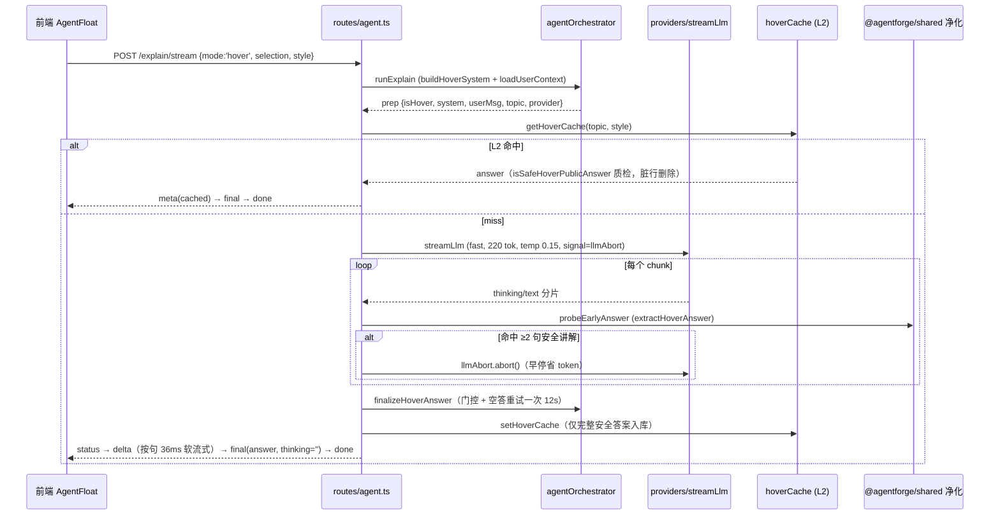

# 悬停 Agent

悬停 Agent 是速度优先的即时讲解：文章内悬停术语/段落/图表（或首页卡片行内替换），约 0.7s 揭示气泡，输出 2–3 句中文卡片。端到端实现：`routes/agent.ts`（`/explain` + `/explain/stream`）→ `services/agentOrchestrator.ts`（`runExplain`/`finalizeHoverAnswer`）→ `services/hoverCache.ts`（L2）→ `lib/sse.ts`（软流式）；净化单一真相在 `@agentforge/shared`（见 [提示词与净化](./prompt-sanitize.md)）。

## 链路总览

## 关键机制

### L2 服务端缓存（services/hoverCache.ts）
- 键：`sha256('v7::' + style + '::' + normalized(topic)).slice(0,48)`；normalized = trim + 小写 + 空白归一 + 截 400 字。**键含版本号 v7**：语义/样式影响内容时 +1，旧键自然过期无需清库（历史版本曾因样式维度与口令泄漏升级）。
- TTL：默认 2h；`hits ≥ 8` 延至 24h（热点知识点少打 LLM）；**过期判定以 `updatedAt` 为基准**（`age = now - updatedAt`，命中重写即刷新）。
- **质检门**：读写均先过 `isSafeHoverPublicAnswer`；读到脏行（历史数据含思考/规则复述）**异步删除**（`void prisma...delete().catch(留日志)`）并视为 miss（防反复毒害）；**只缓存完整 final，中断/半截永不入库**。
- 命中计数：非阻塞 `hits: { increment: 1 }` 更新（`void update().catch` 留痕，不阻塞响应）；写库 upsert 截断 `topic.slice(0,200)` / `answer.slice(0,1200)`；**缓存写失败只记日志（swallowed），不影响主链路**。
- `POST /api/v1/agent/cache/clear`（requireAuth + admin）`deleteMany({})` 全清，响应 `{ ok, cleared: 条数, scope: 'hover-explain-l2', message }`。

### 流式与早停（routes/agent.ts）
- **硬规则**：生成过程中 thinking/text 只在服务端累积；客户端仅收 `status: thinking`（约 120ms 节流）。结束后才把安全答案软流式下发；`final.thinking` 恒 `""`。
- `probeEarlyAnswer`：累积中周期性 `extractHoverAnswer`（**距上次探测 ≥220ms 或 新增 ≥60 字符（OR 关系）任一满足即探测**）；一旦得到 **≥2 句安全讲解**（句数以 `。！` 计）→ `llmAbort.abort()` 早停上游（B-06 打点 `hover_early_stop`）。
- 客户端断开 → `req.on('close')` abort 上游；`res.writableEnded/destroyed` 判定后提前收尾（I2）。
- 答案软流式（`softStreamHoverAnswer`，`lib/sse.ts`）：按 `[^。！？…]*[。！？…]` 分句（对 `。！？…` 任一作句末），句间 36ms 间隔，响应已 ended/destroyed 立即停止。
- 结束时空答案 → `finalizeHoverAnswer` 触发 `retryHoverExplain`：`buildHoverRetrySystem`（无记忆、关 thinking）+ 12s 短超时 + 用户输入截 400 字重试一次；仍空 → `final.answer=""`（前端失败态）。同步版语义一致（B-02）。

### 答案门控（agentOrchestrator + shared）
- `extractHoverAnswer(thinking, text)`：5 路候选（全文/正文/思考/教学段/去改稿），过滤 `isLikelyHoverTeaching && !looksLikeHoverPlanning && isCompleteHoverAnswer`，多句优先、同句数取长。
- `finalizeHoverAnswer`：候选不安全 → 置空 → 重试一次；安全 → `setHoverCache`。

### 同步版（POST /explain）
- L2 命中 → `{ explanation, model:'cache', format:'cache', cached:true }`。
- miss → `callLlm`（fast 220 tok / temp 0.15）→ 同一套 extract + finalize + setCache；`rememberTopic` 记忆留痕。
- deep（mode=click）路径：`extractVisibleAnswer` 门控，命中策划特征仅打点 `deep_planning_leak`（不强制清空，A-04）。

## 聚焦测试

- `routes/agent.sse.test.ts`（真实 loopback HTTP + mock provider/prisma）：
  - 早停：mock 流式在探测阈值后返回 ≥2 句 → 断言 `done` 是最后一个事件、**全程无 thinking 事件**、`final.answer` 非空、**`capturedSignal.aborted === true`**、L2 upsert 被调用。
  - A-01 脱敏：上游抛 `LlmCallError` 带私有网关 url/raw → 客户端 error 事件无泄漏。
  - A-04：deep 模式 thinking 含规则复述片段被拦截，合法 thinking 仍下发。
- `services/hoverCache.test.ts`：键稳定性/规范化/48 位、miss、**脏行删除**、2h 过期、hits≥8 延 24h、写缓存质量门。
- `lib/llm/agentPrompt.hover.test.ts` + `packages/shared/src/smoke.test.ts`：净化回归（12 个命名用例，覆盖改稿/自问/规则回声/任务回声/截断尾）。

## 前端对应

前端气泡状态机（`hoverExplainSession.ts` / `AgentFloat.tsx`）负责 L1 缓存、incomplete 标记、揭示时序与限流——详见 [Agent UI](../frontend/agent-ui.md)。
