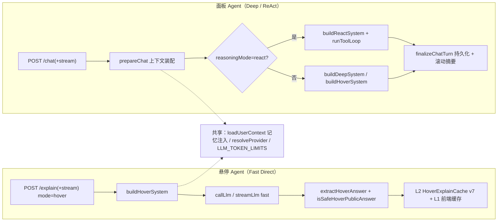

# 双 Agent 体系总览

AgentForge 内置两个 Agent：**悬停 Agent**（文章内即时快讲，速度优先）与 **Agent 面板**（右下角可对话助手，支持真实 tool-loop）。二者共享 Provider（BYOK/服务端默认）、用户风格、学习进度与 `AgentMemory` 基础设施。权威产品文档见 `docs/agent-modes.md`（本页以代码为准）。

## 架构对比

| 维度 | 悬停 Agent | 面板 Agent |
|------|-----------|-----------|
| 触发 | 文章内术语/段落/图表悬停；列表卡片行内替换 | 面板输入；「Agent 详细讲解」按钮（`agentforge:explain` 事件） |
| 推理 | 单轮 Fast Direct（无工具循环） | Deep Structured（Thought→Explain→Practice→Next）或 ReAct tool-loop |
| 输出 | 2–3 句卡片（≤220 字，服务端软流式按句下发） | Markdown 正文 + 可选 thinking；fast 模式只发 status |
| 缓存 | L2 `HoverExplainCache`（v7，2h/24h 热）+ L1 浏览器 20min LRU64 | 无缓存；会话持久化 |
| 思考展示 | 前端只见「思考中」指示，thinking 永不下发 | deep/react 模式经 isSystemEcho 门控后下发 thinking |
| 记忆 | 只读注入（mastered/learning/recentTopics/notes/route） | 注入 + 会话摘要 + 启发式写入偏好记忆 |

## Agent API 路由清单（/api/v1/agent，限流 40/min）

| 方法 | 路径 | 鉴权 | 说明 |
|------|------|------|------|
| GET | `/meta` | 无 | `AGENT_MODE_META`（fast/deep/react）+ 三种 API 格式 |
| GET | `/providers` | optionalAuth | 服务端 Provider + defaultId + byokEnabled + modes |
| POST | `/explain` | optionalAuth | 悬停/点击讲解（同步） |
| POST | `/explain/stream` | optionalAuth | 悬停/点击讲解 SSE |
| POST | `/chat` | optionalAuth | 面板对话（同步；react → tool-loop） |
| POST | `/chat/stream` | optionalAuth | 面板对话 SSE |
| GET | `/memory` | requireAuth | 当前用户 AgentMemory（≤100 条，updatedAt 降序） |
| POST | `/memory` | requireAuth | upsert 记忆（`userId_key` 唯一） |
| POST | `/progress` | requireAuth | 学习进度（mastered 不可降级；mastered → 写 skill 记忆） |
| POST | `/cache/clear` | admin | 清空 L2 悬停缓存（`deleteMany({})`） |

## SSE 事件协议（`lib/sse.ts` + `routes/agent.ts`）

`initSse` 设置 `text/event-stream`；每事件 `data: {json}\n\n`。事件类型：

| 事件 | 载荷 | 出现场景 |
|------|------|----------|
| `meta` | model/format/providerId/mode/style/conversationId/guestKey/reasoningMode/meta | 流开始（chat 必发；explain 缓存命中也发） |
| `status` | `status: 'thinking'` | hover 生成中（约 120ms 节流）；chat fast 模式 |
| `thinking` | `text` | deep/react 模式经 per-delta `isSystemEcho` 门控的安全思考片段（I3） |
| `delta` | `text`（可选 `replace`） | 正文增量；hover 用 `softStreamHoverAnswer` 按句下发（句间 36ms）；tool-loop 最终答案常整段 |
| `tool_call` | `name, args` | ReAct 模式每轮工具调用（仅 react） |
| `tool_result` | `name, ok, preview` | 工具结果摘要（≤160 字；完整 Observation 只进上下文） |
| `final` | `answer, thinking` | 终答；hover 的 `thinking` 恒 `""`、`complete` 标记；chat deep 用安全 thinking |
| `done` | — | 流结束（**最后一个事件**；I5 保证 final/done 在持久化之后） |
| `error` | `message` | 失败（A-01 安全文案，不泄漏 url/raw） |

> 顺序不变量（I5 / B-10）：先 `finalizeChatTurn` 持久化、再发 `final`/`done`；`res.end()` 只调用一次（B-10）。客户端断开 → `req.on('close')` abort 上游（I2）。

## 上下文装配（services/agentOrchestrator.ts）

- `loadUserContext(userId, route)`（services/agentMemory.ts）：游客 → 默认 professional + 空记忆 + byok=null；登录用户 → 解密 BYOK、拉 AgentMemory（≤40）+ LearningProgress（≤50），组装 `formatMemoryBlock`（mastered/learning/notes/recentTopics/route，总长 ≤800 字，D-03）。
- `resolveProvider(ctx.byok)`：BYOK 优先，其次服务端默认；两者皆无 → 400 `NO_PROVIDER`。
- 会话历史：`ensureConversation` + `loadRecentMessages`，按 mode 的 **token 预算从最新向前累加**（fast 600 / deep 2000，`estimateTokens` 中文 ~1.5 字/token）；system = 模式 base prompt + 会话摘要 + 历史块（B-09）。
- 答案门控：hover → `extractHoverAnswer` + `isSafeHoverPublicAnswer`（shared）；deep/chat → `extractVisibleAnswer`（A-04 规则复述质检，命中 → 兜底文案，不持久化空消息）。

## 编排层拆分（C-02）

- `routes/agent.ts`：HTTP/SSE 适配（校验、限流归属、res 收尾）。
- `services/agentOrchestrator.ts`：`runExplain` / `prepareChat` / `finalizeChatTurn` / `finalizeHoverAnswer` / `retryHoverExplain` / `llmError` / `noProviderError`。
- `services/agentConversation.ts`：会话生命周期（ACL/TTL/摘要）。
- `services/agentMemory.ts`：记忆读写与上下文。
- `services/hoverCache.ts`：L2 缓存。

## 相关页面

- [悬停 Agent](./hover-agent.md) / [面板对话](./chat-panel.md) / [ReAct tool-loop](./tool-loop.md)
- [LLM Provider](./llm-providers.md) / [提示词与净化](./prompt-sanitize.md)
- 前端链路：[Agent UI](../frontend/agent-ui.md)
