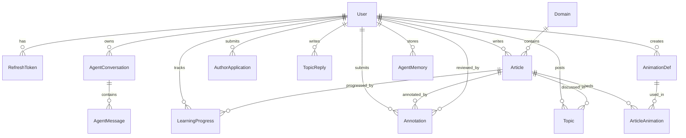

# 数据模型（Prisma）

`apps/api/prisma/schema.prisma` 定义 15 个模型，datasource 为 SQLite（`DATABASE_URL`，默认 `file:./dev.db`；生产可切 PostgreSQL）。所有 ID 均为 `cuid()`；`User`、`Article` 等带 `createdAt/updatedAt`。多个字段以 **JSON 字符串** 存储（`Article.tags`、`AnimationDef.steps/config`、`User.preferences`），由 `services/serialize.ts` 或 `lib/prefs.ts` 解析——改这些字段格式必须同步序列化层。

## 实体关系总览

## 模型逐一说明

### User
- 身份字段：`role`（reader | author | admin，游客不入库）、`authorTier`（none | standard | elite）、`adminLevel`（0=非管理员；1–100，100 超级管理员）。
- `allowAgentAnnotationReview`：是否允许 Agent 代审批注——**字段已有但 Agent 自动审尚未接线**（人工审核走 `/api/v1/annotations`）。
- `preferences`：JSON 字符串，承载 `{ agentStyle, autoplayAnim, animSpeed, byok }`（解析见 `lib/prefs.ts`；BYOK 见 [设置与 BYOK](../backend/settings-byok.md)）。
- 关联：articles、animations、applications、progress、agentMemories、domainsCreated、topics、topicReplies、annotations、conversations、annotationReviews、refreshTokens。

### RefreshToken
- 仅存 `tokenHash`（refresh 明文的 sha256；明文只在下发时出现一次），**`tokenHash` 带 `@unique` 约束**（同一明文不可重复落库，配合旋转原子性防重放）；`expiresAt`、`revokedAt`（墓碑）。`@@index([userId])`。
- 生命周期：签发 → 旋转（refresh 时原子 `updateMany` 吊销旧条）→ logout 批量吊销。见 [身份与用户](../backend/auth-users.md)。

### Domain
- `slug` 唯一；`track` ∈ agent | llm（两套学习路径）；`sortOrder/color/published`；`createdById` 可空（删除后 SetNull）。
- 删除领域时事务内先 `article.updateMany(domainId=null)` 再删（`routes/domains.ts` DELETE）。

### AuthorApplication
- `kind` ∈ author | elite；`status` pending | approved | rejected；`reviewedAt`。
- **并发唯一护栏**：`pendingGuard` 仅在 pending 时写入 `${userId}:${kind}`，审核后置 null；`@@unique([pendingGuard])` 防止同一用户并发双提交（P2002 映射为 CONFLICT）。
- 审批通过时事务内升级用户：author → `role=author, authorTier=standard`；elite → `authorTier=elite`。

### Article
- `slug` 唯一；`category`（见 shared `ARTICLE_CATEGORIES`）、`level`（入门/中级/高级）、`status`（draft | published）、`tags` JSON 字符串、`viewCount`、`publishedAt`。
- 阅读量 24h 去重（进程内存 Map，见 `routes/articles.ts` `shouldCountView`）；发布门槛为标题+正文非空。
- 索引：`[status, category]`、`[status, domainId]`、`[authorId]`、`[status, viewCount]`、`[status, publishedAt]`。

### AnimationDef / ArticleAnimation
- `AnimationDef`：`template`（shared `AnimationTemplate`：react/cot/tot/got/loop/mcp/tool/memory/harness）、`steps`/`config` JSON 字符串。
- `ArticleAnimation`：文章-动画多对多关联，`sortOrder` 决定嵌入顺序，`@@unique([articleId, animationId])`；文章 PATCH 时 `deleteMany + createMany` 重建关联。

### Topic / TopicReply
- `Topic`：`kind` ∈ discussion | question | opinion；`status`（open 为主，软删除置 deleted）；可关联 `articleId`（SetNull）。列表接口摘要截断 160 字（`toTopicSummary(bodyMax)`）。
- `TopicReply`：`@@index([topicId])`；详情接口按 createdAt 升序取 ≤100 条。

### Annotation
- 文章批注：`anchorText`（锚定选中文本）、`sectionId`、`body`、`status`（pending | approved | rejected）、`reviewBy`（author | agent | admin）、`reviewerId`、`agentNote`。
- 可见性/审核 ACL 见 `services/annotationAcl.ts` 与 [社区域](../backend/community.md)。

### AgentConversation / AgentMessage
- 面板对话会话：`userId` 可空（匿名）；匿名必须带 `guestKey`（防 IDOR，见 [面板对话](../agent/chat-panel.md)）；**匿名会话 `expiresAt` = 7 天 TTL，登录用户会话 `expiresAt` 存 `null`（长期保留）**；过期匿名会话由 `maybePurgeGuestConversations` 用 `deleteMany` 清理（每 10 分钟节流一次，`@@index([expiresAt])` 支撑），级联删消息。
- `summary`：消息 >24 条时由最旧 8 条压缩而来（滚动摘要，见 `agentConversation.persistTurn`）。
- `AgentMessage`：`role`、`content`、`thinking`（thinking 不随正文展示）。

### AgentMemory
- 用户级记忆：`key`（唯一 per user）+ `value` + `kind`（fact | skill | preference | summary）。
- 命名约定：`seen:{topic}`（最近话题）、`pref:{sha256}`（显式「请记住…」偏好，≤20 条淘汰最旧）、`mastered:{articleSlug}`（掌握文章 → skill）。
- `@@unique([userId, key])`，写入一律 `upsert`。

### LearningProgress
- `@@unique([userId, articleId])`；`progress` 0–1；`mastery` not_started | learning | mastered。
- 不变量：`mastered` **不可降级**；`progress` 只增不减；`mastered` 时自动写 `AgentMemory(kind=skill)`。

### HoverExplainCache
- 悬停讲解 L2 服务端缓存：`cacheKey`（`sha256('v7::'+style+'::'+normalized topic).slice(0,48)`）唯一；`hits` 用于热点延长；`answer` 仅存经 `isSafeHoverPublicAnswer` 质检的完整讲解。
- TTL：默认 2h；`hits ≥ 8` 延至 24h；脏行（质检失败）读取时即删除。详见 [悬停 Agent](../agent/hover-agent.md)。

## 种子内容（seed.ts + seed-content.ts）

`apps/api/prisma/seed.ts`（`npm run db:seed` 入口，tsx 运行）：

- **超管**：`SEED_ADMIN_EMAIL`（默认 admin@agentforge.local）+ **`SEED_ADMIN_PASSWORD` 必填（≥8 字符，无内置兜底口令）**；角色 admin、adminLevel=100、authorTier=elite。已存在同邮箱用户**不自动提权**，需 `SEED_FORCE_ADMIN=1` 才强制提权（不重置密码）。
- **5 个领域**（upsert by slug）：reasoning（推理模式）、frameworks（开发框架）、protocols（协议与集成）、engineering（工程实践）、llm-foundations（LLM 基础）；由 `DOMAIN_DEFS` 的 `match` 谓词把文章映射到领域，具体规则：reasoning ← category 恰为「推理模式」或 slug ∈ react/cot/tot/got；frameworks ← category 恰为「框架」或 slug 以 `frameworks` 开头；protocols ← category「协议」或 slug=mcp；engineering ← category「工程实践」或 slug ∈ context/loop/harness/memory/evaluation/tool-use/prompt-eng；llm-foundations ← category「LLM基础」或 slug ∈ llm-basics/transformers/tokenization/fine-tuning/prompting。
- **20 篇种子文章 + 配套动画**（`seed-content.ts` 的 `DEFAULT_ARTICLE_SEEDS`）：每篇 upsert `AnimationDef`（固定 id）与 `Article`（by slug，update 不重置 publishedAt）；动画关联**只补缺失不重建**（不 deleteMany，保留用户手动关联）。

> 种子幂等：重复执行不重复建数据；`db:seed` 依赖 `prisma db push` 已建表（无 migration 目录，开发流程为 db push）。
