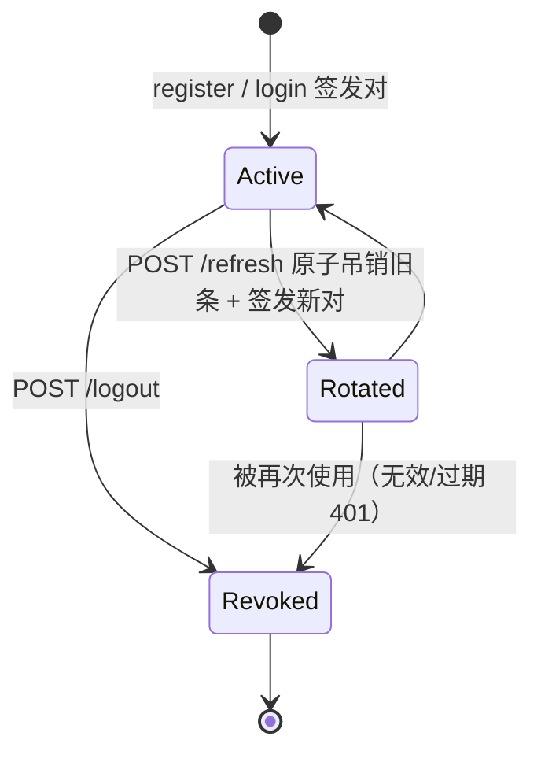
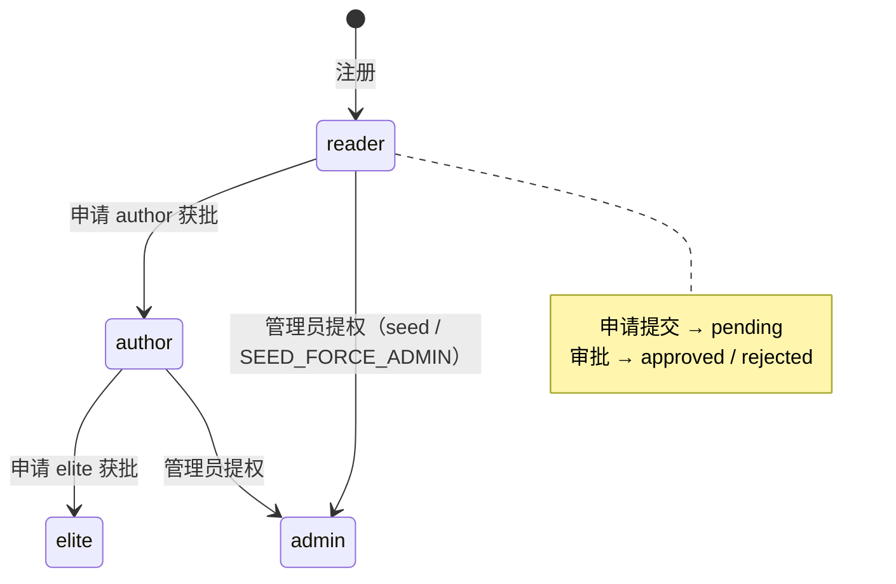

# 身份认证、用户与作者申请

路由文件：`apps/api/src/routes/auth.ts`、`apps/api/src/routes/applications.ts`；令牌逻辑在 `lib/jwt.ts`；授权矩阵在 `@agentforge/shared`。

## 认证端点（/api/v1/auth，限流 20/min）

| 方法 | 路径 | 鉴权 | 行为 |
|------|------|------|------|
| POST | `/register` | 公开 | email 小写化 + 唯一检查（冲突 409）；密码 ≥8 ≤128；创建 role=reader + authorTier='none' + adminLevel=0（`prisma.user.create` 显式写入，与 schema 默认值一致）；返回 token 对 |
| POST | `/login` | 公开 | 邮箱小写查找 + bcrypt 校验（统一 401「邮箱或密码错误」，不泄露账号存在性） |
| POST | `/refresh` | 公开（凭 refresh） | **原子旋转吊销**：`updateMany where tokenHash & revokedAt:null & expiresAt>now` 置 revokedAt；成功才签发新对 |
| GET | `/me` | requireAuth | 返回 `{ user: PublicUser }` |
| PATCH | `/me` | requireAuth | 更新 name/bio/headline/website/avatarUrl/allowAgentAnnotationReview；**资料变更后轮换令牌对**（新 claims 立即生效） |
| POST | `/logout` | optionalAuth | 已登录 → 吊销该用户全部未过期 refresh；仅持 refresh（access 失效）→ 按 hash 吊销单条 |

`issueTokenPair(user)`：签发 access（claims 含 role/authorTier/adminLevel）+ 新 refresh（明文下发，`hashRefreshToken` 入库，`expiresAt = refreshExpiresAt()`）。

### 令牌生命周期

> 关键不变量：**refresh 一次性**——旋转即吊销旧条，并发请求只有一方成功（防重放）；DB 只存 sha256，明文泄露面最小化。前端 `api.ts` 单飞 refresh 与 401 重试见 [前端总览](../frontend/overview.md)。

## 用户资料

- `PATCH /me` 的 claims 轮换意味着前端保存资料后应保存新的 access/refresh（`ProfilePage` 用 `setTokens` + `refresh()` 处理）。
- `allowAgentAnnotationReview`：作者是否允许 Agent 代审批注（**字段已有，Agent 自动审尚未接线**）。

## 作者申请 / 审批（/api/v1/author-applications）

申请类型 `kind` ∈ author | elite：

- **POST /**（requireAuth，`author.apply` / `author.elite_apply` 语义由路由前置守卫体现）：
  - author：已是 author/admin → 400；elite：必须先为 author 且未 elite。
  - `pendingGuard = ${userId}:${kind}` 写入行；事务内先 `findFirst(pending)` 拦截同类型待审申请，再 create；`@@unique([pendingGuard])` 兜底并发双提交（P2002 → 409 CONFLICT「你已有待审核的同类申请」）。
- **GET /**（requireRole admin）：全部申请 + 用户摘要（email/name/role/authorTier）。
- **PATCH /:id**（requirePermission `user.manage`，即 adminLevel ≥50）：仅 pending 可处理；事务内更新 status/reviewedAt/清 pendingGuard，**通过时升级用户**：author → role=author + authorTier=standard；elite → role=author + authorTier=elite。

### 作者身份状态机

## 聚焦测试

- `lib/jwt.test.ts`：时长解析（`parseDurationMs` 仅接受 `s|m|h|d` 数字后缀——如 30s/15m/2h/7d，其他后缀抛「无效过期时长」）、refresh 高熵且不可逆（sha256 hex64）、`JWT_ACCESS_EXPIRES_IN` 优先于旧 `JWT_EXPIRES_IN`。
- `services/agentConversation.test.ts`：会话 ACL（他人会话/过期/guestKey 不匹配 → 新建），与身份模型配合的匿名路径。
- 注意：**refresh 旋转的并发原子性无独立单测**（逻辑在 auth.ts 路由内），改动该路径时建议补测。

## 相关页面

- 授权矩阵细节：[安全](../architecture/security.md)、[packages/shared](../packages/shared.md)
- 前端入口：[页面清单（AuthPages / ProfilePage / ApplyAuthorPage / ApplicationsAdminPage）](../frontend/pages.md)
