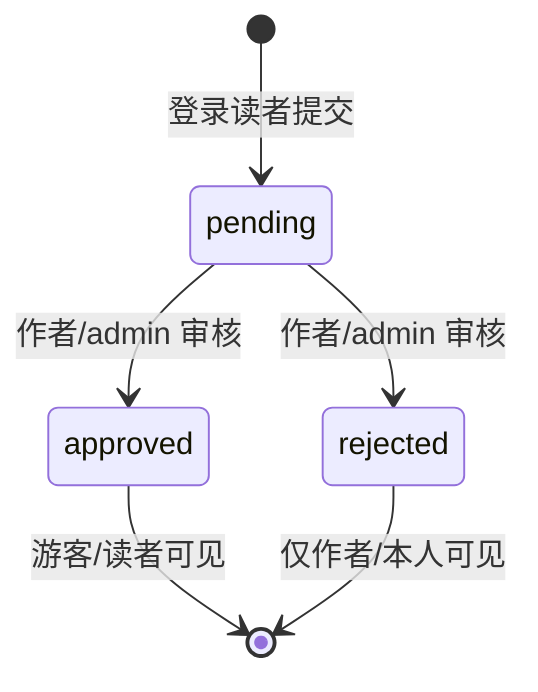

# 社区域：话题与文章批注

路由文件：`routes/topics.ts`、`routes/annotations.ts`；批注 ACL 在 `services/annotationAcl.ts`；DTO 映射见 `services/serialize.ts`（`toTopicSummary`、`toAnnotationItem`）。

## 话题（/api/v1/topics）

| 方法 | 路径 | 鉴权 | 行为 |
|------|------|------|------|
| GET | `/` | optionalAuth | 列表：`status != deleted`；`articleId` 过滤；分页 pageSize ≤40 默认 20；**列表只回 160 字摘要**（`toTopicSummary(bodyMax:160)`，避免 8000 字正文随列表下发）；含作者、关联文章、回复数 |
| GET | `/:id` | optionalAuth | 详情：全文 + 回复（createdAt 升序，≤100 条）；deleted → 404 |
| POST | `/` | requireAuth + `topic.post` | 创建；`articleId` 或 `articleSlug`（slug 查 id，不存在 400）；kind ∈ discussion/question/opinion |
| POST | `/:id/replies` | requireAuth + `topic.post` | 回复；deleted 话题 → 404 |
| DELETE | `/:id` | requireAuth | **软删除**（status=deleted）；仅 owner 或 admin |

- 校验：标题 2–200 字、正文 ≤8000、回复 ≤4000。
- 前端：`TopicsPage`（列表/详情/新建三合一文件）；文章页 footer「就本文发帖 →」带 `?article={slug}`。

## 批注（/api/v1/annotations）

批注是「读者为文章内容追加说明、作者/管理员审核」的社区机制：

| 方法 | 路径 | 鉴权 | 行为 |
|------|------|------|------|
| GET | `/` | optionalAuth | 必须 `articleId` 或 `articleSlug`（否则 400）；按 ACL 过滤（见下）；createdAt 降序 ≤200 条 |
| POST | `/` | requireAuth + `annotation.write` | 提交 → status=pending；锚定 `anchorText`（≤2000）、可选 `sectionId`、正文 ≤4000 |
| PATCH | `/:id` | requireAuth | 审核：仅 pending 可审；`canReviewAnnotation` 校验；写 `reviewBy/resolvedAt/reviewerId/agentNote` |

### ACL 三函数（services/annotationAcl.ts）

- `annotationListWhere({ viewerId, isArticleAuthor, isAdmin })`：
  - 文章作者或 admin → `{}`（全部，含 pending/rejected）；
  - 登录读者 → `OR: [approved, 自己的]`；
  - 游客 → 仅 `approved`。
- `canReviewAnnotation({ user, articleAuthorId })`：文章作者本人 true；**普通作者不能跨文审**（即使 elite 的 `moderation.review` 也不跨文）；admin 需 `moderation.review` 或 `admin.full`。
- `resolveReviewBy({ reviewerId, articleAuthorId, reviewerRole })`：文章作者 → `'author'`（即使其同时是 admin，author 优先）；否则 admin → `'admin'`。

> 预留：`AgentMemory`/`User.allowAgentAnnotationReview` 支持未来的 Agent 自动审核（`reviewBy: 'agent'` 枚举已定义），**尚未接线**。

## 聚焦测试

- `services/annotationAcl.test.ts`：guest 仅 approved；登录读者 OR 自己的；作者/admin 全量；**elite 作者不能跨文审**；`resolveReviewBy` 的 author 优先于 admin。
- 批注路由无独立单测文件，ACL 纯函数测试即主证据。

## 相关页面

- 前端批注 UI（最小列表 + 提交表单）在 `ArticlePage` 内联组件 `ArticleAnnotations`（无审核 UI，审核仍为 API 级能力）：[页面清单](../frontend/pages.md)。
