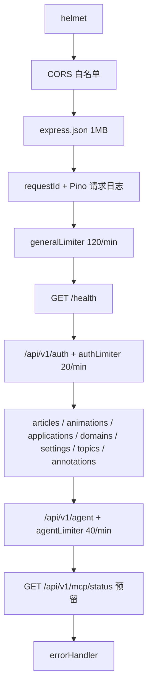

# 后端总览（apps/api）

`apps/api` 是 Express 5 + Prisma 6 的 REST API 与站内 Agent 后端，入口 `src/index.ts`（dotenv → `createApp()` → listen `PORT` 默认 3001）。

## 组装顺序（`src/app.ts` createApp）

- `trust proxy`：仅 `TRUST_PROXY=1` 时信任反向代理（防伪造 XFF 绕过限流）。
- 每个请求生成 8 位 hex `requestId`（`res.locals.requestId`），请求日志含 method/url/status/ms；错误处理也引用它关联日志。
- 路由挂载：auth（限流 20/min）、articles、animations、author-applications、domains、settings、topics、annotations、agent（限流 40/min）、`GET /api/v1/mcp/status`（MCP 预留探测，返回 `{ ok, protocol:'mcp', status:'reserved' }`）。

## 中间件

### auth.ts（`middleware/auth.ts`）
`AuthUser` = `{ id, email, role, authorTier, adminLevel }`，从 access payload 解析（`fromPayload` 兜底：缺 `authorTier` → author 角色默认 `standard`、**其余角色默认 `none`**；缺 `adminLevel` → admin 角色默认 `1`、**其余角色默认 `0`**）。导出：

- `optionalAuth`：有 Bearer 则解析并挂 `req.user`，坏 token 忽略（游客语义）。
- `requireAuth`：缺失/无效 → 401。
- `requireRole(...roles)`：身份不在列表 → 403。
- `requirePermission(...perms)`：用 shared `can()` **逐项校验（`perms.every`，即需同时满足列出的全部权限）**（含 authorTier/adminLevel 分级）；未认证（无 `req.user`）→ 401，权限不足 → 403。
- `requireAdminLevel(min)`：非 admin 或 level 不足 → 403（未认证同样先 401）。

### validate.ts（`middleware/validate.ts`）
`validate(schema, target='body'|'query'|'params')`：Zod `safeParse`，失败传 ZodError（errorHandler → 400 `VALIDATION_ERROR`），成功把解析结果写回 `req[target]`。

### errorHandler.ts（`middleware/errorHandler.ts`）
统一错误体 `{ error: { code, message } }`：

- `AppError` → 其 status/code/message（构造见 `lib/errors.ts`：`badRequest/unauthorized/forbidden/notFound/conflict`）。
- `ZodError` → 400 `VALIDATION_ERROR`（拼接各 issue message）。
- Prisma P2002 → 409 `CONFLICT`；P2003 → 400 `BAD_REQUEST`；P2025 → 404 `NOT_FOUND`。
- 其他 → 500 `INTERNAL_ERROR`（production 隐藏 message）；错误带 requestId 写结构化日志。

## lib 基础设施

| 模块 | 职责 |
|------|------|
| `prisma.ts` | `PrismaClient` 单例挂 `globalThis`（HMR/测试复用）；dev 日志 level error+warn |
| `logger.ts` | Pino 单例；`LOG_LEVEL`（默认 info）；非 production 用 pino-pretty，production 纯 JSON（base service: agentforge-api） |
| `jwt.ts` | `signAccessToken`（JWT_ACCESS_EXPIRES_IN || JWT_EXPIRES_IN || 15m）、`verifyAccessToken`、`generateRefreshToken`（32B base64url）、`hashRefreshToken`（sha256）、`refreshExpiresAt`（7d）、`parseDurationMs`（15m/7d 等） |
| `hash.ts` | bcrypt hash/verify，cost 12 |
| `errors.ts` | `AppError(status, code, message)` + 快捷构造 |
| `params.ts` | `param(req, name)`：Express 5 的 params 可能为 string[]，取首个 |
| `prefs.ts` | `parsePrefs(raw)`：`User.preferences` JSON 解析，失败回退 `{}`（settings 与 agent 共用，消除双份实现） |
| `sse.ts` | `initSse`（`text/event-stream; charset=utf-8`、no-cache no-transform、keep-alive）、`sseWrite`（`data: {json}\n\n`）、`softStreamHoverAnswer`（按 `[。！？…]` 分句软流式，句间 36ms，响应 ended/destroyed 即停） |
| `byokCrypto.ts` / `byokUrlPolicy.ts` | BYOK 密钥静态加密与 SSRF 校验（见 [安全](../architecture/security.md) 与 [设置与 BYOK](./settings-byok.md)） |

## 服务层（services/）

| 服务 | 职责 | 详情页 |
|------|------|--------|
| `serialize.ts` | DTO 映射：`toPublicUser/toArticleSummary/toArticleDetail/toAnimationDef/toTopicSummary/toAnnotationItem` + `slugify` | [内容域](./content.md) |
| `hoverCache.ts` | 悬停 L2 缓存（v7 键、2h/24h TTL、脏行删除） | [悬停 Agent](../agent/hover-agent.md) |
| `agentMemory.ts` | 用户上下文（风格/记忆/BYOK）、话题记忆、偏好记忆 | [面板对话](../agent/chat-panel.md) |
| `agentConversation.ts` | 会话 ACL、匿名 TTL、消息持久化与滚动摘要 | [面板对话](../agent/chat-panel.md) |
| `agentOrchestrator.ts` | 讲解/对话的上下文组装、答案门控、错误映射与收尾 | [Agent 体系总览](../agent/overview.md) |
| `annotationAcl.ts` | 批注可见性/审核 ACL（`annotationListWhere/canReviewAnnotation/resolveReviewBy`） | [社区域](./community.md) |

## 路由清单速查

| 前缀 | 页面 |
|------|------|
| `/api/v1/auth` | [身份与用户](./auth-users.md) |
| `/api/v1/articles` `/animations` `/domains` | [内容域](./content.md) |
| `/api/v1/topics` `/annotations` | [社区域](./community.md) |
| `/api/v1/settings` | [设置与 BYOK](./settings-byok.md) |
| `/api/v1/agent` | [Agent 体系总览](../agent/overview.md) |

> 变更提示：新增路由 → 在 `createApp` 挂载并考虑限流归属；新增校验 → 用 `validate`；抛错 → 用 `lib/errors` 快捷构造，errorHandler 自动映射。错误契约对前端 `ApiError` 是硬性依赖（前端按 status/code/message 分支）。
