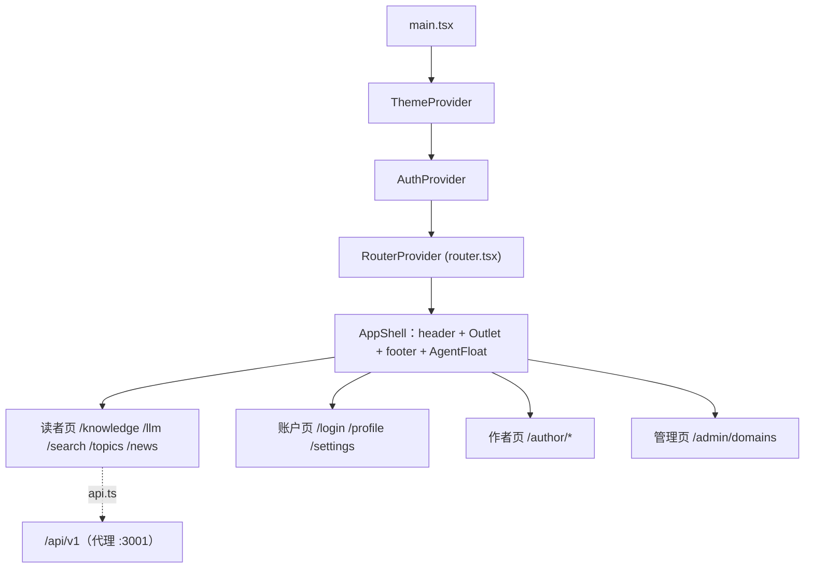

# Web 前端总览

`apps/web`：Vite 8 + React 19 + TypeScript + React Router 7 的 SPA（读者 + 作者 + 管理三端）。端口 **5280**（strictPort，`host: 127.0.0.1`），dev 下 `/api` 代理到 `http://127.0.0.1:3001`（`vite.config.ts`；vite dev 强制 `NODE_ENV=development` 防 React Refresh 半注入白屏）。`@` 别名 → `src`。

## 提供者树（main.tsx）

`ThemeProvider` → `AuthProvider` → `RouterProvider`。Auth 在 AppShell 之下即可用 `useAuth()`（登录态、`can(perm)`、`isAuthor/isAdmin/isEliteAuthor`）。

## 路由表（app/router.tsx）

约 22 条路由 + 内联 404 兜底（渲染在 AppShell 内）：

- 读者：`/` HomePage · `/knowledge` / `/llm` 总览 · `/knowledge/:slug` / `/llm/:slug` ArticlePage（按 track 分挂载点）· `/domains/:slug` · `/search` · `/news` · `/topics[/new|/:id]`
- 账户：`/login` · `/register` · `/profile` · `/settings`
- 作者：`/author` · `/author/articles/new|:id/edit` · `/author/animations/new|:id/edit` · `/author/apply` · `/author/applications`
- 管理：`/admin/domains`

## 布局（components/layout/AppShell.tsx）

粘性毛玻璃 header（桌面 NavLink 导航、header 搜索表单 → `/search?q=`、主题/强调色切换、登录用户名）、`Outlet`、footer、全局 `AgentFloat`（悬停气泡 + 面板）。移动端隐藏搜索、折叠导航（<768px）。

## API 客户端（lib/api.ts）

- `BASE = VITE_API_BASE_URL || '/api/v1'`。
- `request<T>`：默认 **15s 超时**（AbortController 与调用方 signal 合成）；JSON Content-Type；附 Bearer access；**401 时单飞 refresh 一次后重试原请求**（跳过 refresh/logout/login/register 自身；`refreshInFlight` 防并发风暴）；超时 → `ApiError(408, 'TIMEOUT')`。
- `ApiError { status, code, message }`（服务端 `error.code/message` 契约）。
- `api` 对象覆盖全部后端端点：auth（register/login/refresh/me/logout）、articles（list/get/create/update/publish）、animations（list/get/create/update）、applications（apply/list/review）、domains（list/get/create/update/delete）、settings（get/update/test-llm）、topics（list/get/create/reply）、annotations（list/create/review）、agent（explain/chat/providers/progress/cache/clear）。
- 另导出 `setTokens/clearTokens` 等 token 读写（见下）。

## Token 与匿名身份存储

- `lib/apiToken.ts`：localStorage `agentforge-token`（access）、`agentforge-refresh-token`（refresh）。**当前为 localStorage 方案**；HttpOnly cookie 迁移为待办（`docs/httponly-cookie-migration.md`，XSS 可窃取是已知风险）。
- `lib/guestKey.ts`：localStorage `agentforge-guest-key`（≥16 字符，UUID 拼接或随机兜底）；随面板 chat 请求回传，服务端据此做匿名会话 ACL。
- `useAuth.refresh()`：仅 401/403 清 token 强制登出；网络/5xx 保留登录态。

## 主题与风格

- `hooks/useTheme.tsx`：`ThemeProvider`/`useTheme`/`ACCENTS`（6 种强调色）；localStorage `agentforge-theme`/`agentforge-accent`；`prefers-color-scheme` 回退；`<html data-accent>` 属性；SSR 安全。
- `hooks/useAgentStyle.ts`：读 `GET /settings/me` 的 agentStyle；`useAgentStyle(defaultStyle, override?)`——无用户时保持默认且**不强制写回**（气泡默认 professional、卡片默认 concise）。
- `styles/tokens.css` + `global.css`：CSS 变量（`--primary`、`--chart-1..5`、`--muted-foreground` 等）贯穿动画角色配色与组件样式。

## 关键变更面

- **改 API 契约**：`lib/api.ts` + `packages/shared` DTO 双端同步（见 [packages/shared](../packages/shared.md)）。
- **改路由**：`app/router.tsx` 一处；页面文件在 `pages/` 按域组织。
- **改 token 存储**（HttpOnly 迁移）：`apiToken.ts` + `api.ts` 的 refresh 单飞逻辑 + `useAuth`，方案见 `docs/httponly-cookie-migration.md`。

## 相关页面

- [页面清单（读者/账户/作者/管理）](./pages.md)
- [Agent UI 全链路](./agent-ui.md) · [动画引擎](./animation-system.md) · [Markdown 管线](./markdown-pipeline.md)
- 后端对应：[后端总览](../backend/overview.md)
